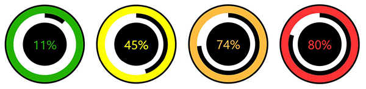

# React Circular Progression Widget

---

### Sample Deployment

[scottfalbo.github.io/react-circle-prog-widget](https://scottfalbo.github.io/react-circle-prog-widget)

---

## Summary

This widget was created using React and displays a circular progression bar that changes colors based on value.  The sample deployment is setup with a random number generator for display purposes, but has a commented out input element for user input to customize the source of the display value.

---

## Tools Used

<table border>
  <tr align=center>
    <td width=80>
       
    </td>
    <td width=80>
      
    </td>
    <td width=80>
      
    </td>
  </tr>
    <tr>
    <td align=center>
      JavaScript
    </td>
    <td align=center>
      React
    </td>
    <td align=center>
      VS Code
    </td>
  </tr>
    <tr align=center>
    <td width=80>
       
    </td>
    <td width=80>
      
    </td>
    <td width=80>
      
    </td>
  </tr>
    <tr>
    <td align=center>
      HTML5
    </td>
    <td align=center>
      CSS3
    </td>
    <td align=center>
      GitHub
    </td>
  </tr>
</table>

---

## Getting Started
+ `git clone https://github.com/scottfalbo/react-circle-prog-widget.git`.
+ `npm install` for dependencies.
+ `npm start` to run the sample App locally.

## Usage
+ Copy the following files to use the widget in your project.
    + Components
        + `Controller.js`
        + `DataInput.js`
        + `DataDisplay.js`
        + / styles
            + `controller.css`
            + `dataInput.css`
            + `dataDisplay.css`
+ Include the `<Controller />` component where you want the widget to appear in your app.

+ ### Customize your Query
+ `DataInput.js`
    + `render()` Uncomment the input element to enable user input.
    + `handSubmission()` Passes the user query to a function called `fakeQuery(query)`.
        + `fakeQuery()` currently generates a random number for sample display purposes.  Rename this function and add your business logic here.

---

## Change Log

+ 06/25/2021
    + Created and deployed.

## Author
[Scott Falbo](https://www.scottfalbo.com)

## Attributions
+ [GhPage React Deployment](https://www.pluralsight.com/guides/deploying-react-on-github-pages)
+ [CSS Reference](https://github.com/tiagobalmeida/purecss-circular-progress-bar)
